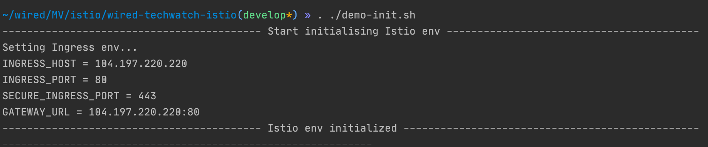
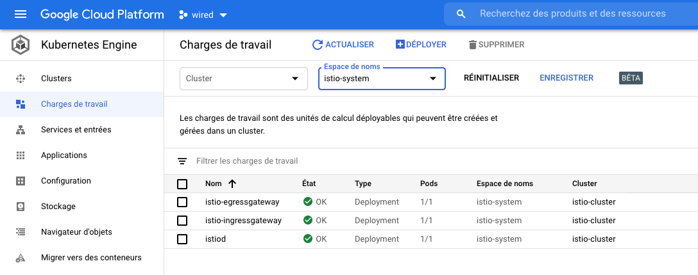

# Istio 1.7.3

[Istio](https://istio.io/latest/docs/concepts/what-is-istio/), a service mesh to connect, secure, control, and observe services on kubernetes platforms.
At a high level, Istio helps reduce the complexity of these deployments, 
and eases the strain on your development teams.

## Requirements:

You need a running Kubernetes cluster. 

## Install the Istio engine

- Run the init script [demo-init.sh](demo-init.sh) to download and install Istio 1.7.3 
  and then set ingress env exporting `INGRESS_HOST`, `INGRESS_PORT`, `SECURE_INGRESS_PORT`, and `GATEWAY_URL`.

    

    

