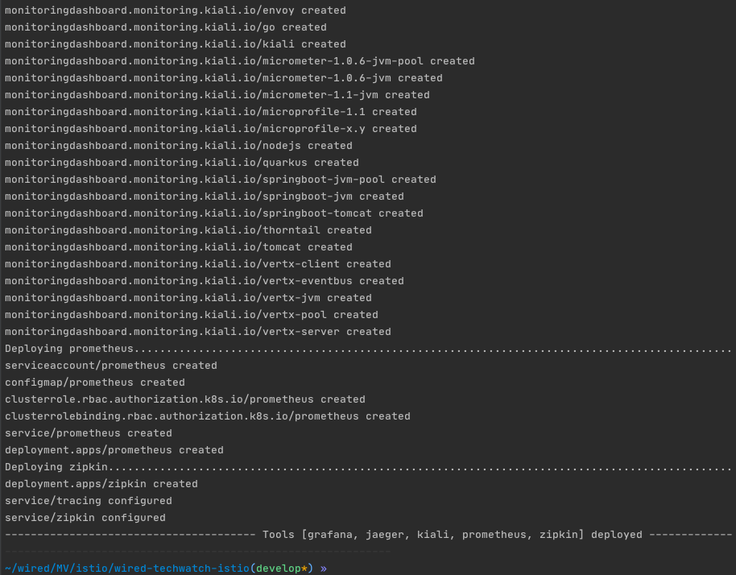
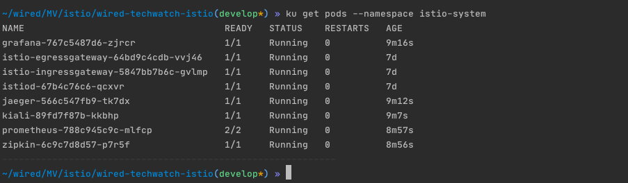
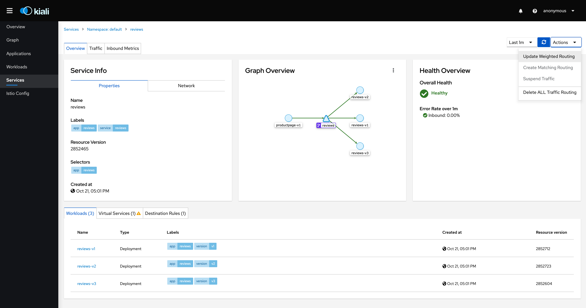
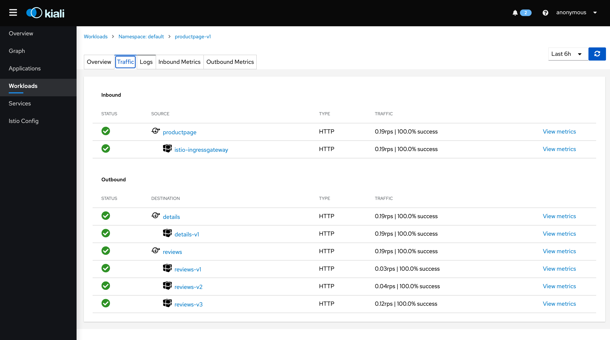

# Istio 1.7.3

[Istio](https://istio.io/latest/docs/concepts/what-is-istio/), a service mesh to connect, secure, control, and observe services on kubernetes platforms.
At a high level, Istio helps reduce the complexity of these deployments, 
and eases the strain on your development teams.

## Requirements:

You need a running Kubernetes cluster. 

## Install the Istio engine

- Run the init script [demo-init.sh](demo-init.sh) to download and install Istio 1.7.3 
  and then set ingress env exporting `INGRESS_HOST`, `INGRESS_PORT`, `SECURE_INGRESS_PORT`, and `GATEWAY_URL`.

    

    

## Deploy a sample application
- Run the app script [demo-run-app.sh](demo-run-app.sh) to deploy our [app](https://istio.io/docs/examples/bookinfo/)

  

  Accessing the app following the logged url: http://104.197.220.220:80/productpage
  

- Check deployment status (kubernetes namespace=default)

  - On terminal using command: `kubectl get pods --namespace default`
    

  - On [workload GCP console](https://console.cloud.google.com/kubernetes/workload)
    

## Install the Istio tools (UIs)
- The available tools UIs:

  

- Run the Istio tools setup script [demo-tools.s](demo-tools.sh)

  
  

- Check deployment status (kubernetes namespace=istio-system)

  - On terminal using command: `kubectl get pods --namespace istio-system`
    

  - On [workload GCP console](https://console.cloud.google.com/kubernetes/workload)
    

- #### Grafana

  Run this command to start a proxy session accessing Grafana service UI
    ````shell script
    istioctl dashboard grafana
    ````
  

  

  We will download [grafana-istio-mesh-dashboard.json](grafana-istio-mesh-dashboard.json)
  from [grafana dashboards repository](https://grafana.com/grafana/dashboards/7639)
  and import it on grafana UI. Will produce the following dashboards:

  

  Dashboard of a specific pod (productpage)

  

  

  

- #### Jaeger
  Run this command to start a proxy session accessing jaeger service UI
    ````shell script
    istioctl dashboard jaeger
    ````
  

  

- #### Kiali

  Start a proxy session rooting to Kiali service UI using command
    ````shell script
    istioctl dashboard kiali
    ````
  

  

  

  

  

- #### Prometheus
  Run this command to start a proxy session accessing Prometheus service UI
    ````shell script
    istioctl dashboard prometheus
    ````
  

  

  

- #### Zipkin
  Run this command to start a proxy session accessing zipkin service UI
    ````shell script
    istioctl dashboard zipkin
    ````
  

  

  

  
    
